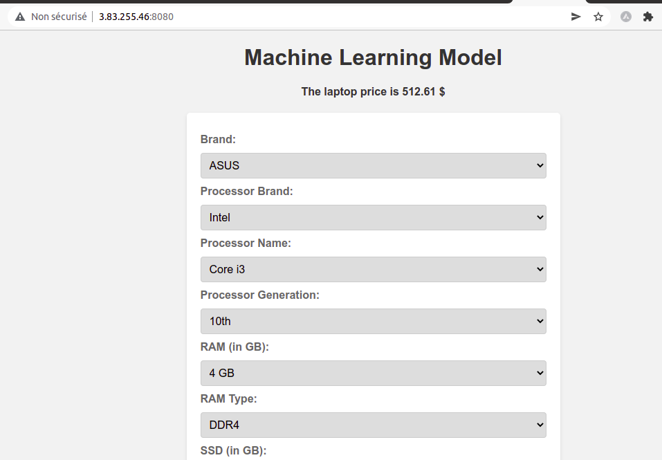

# Laptop Price Prediction Flask App

This project is a Flask web application that uses machine learning to predict laptop prices. It has been Dockerized and deployed on AWS using EC2/ECR. Continuous integration and continuous deployment (CI/CD) have been set up using GitHub Actions.

## Software and tools requirements

1. [Github Account](https://github.com)
2. [VS Code IDE](https://code.visualstudio.com/)
3. [AWS Account](https://aws.com)

## Dataset link
[Dataset](https://www.kaggle.com/datasets/anubhavgoyal10/laptop-prices-dataset?select=laptopPrice.csv)

## Features

- Predicts laptop prices based on machine learning models
- User-friendly web interface built with Flask
- Dockerized for easy deployment and portability
- Deployed on AWS using EC2/ECR
- CI/CD with GitHub Actions for automated testing and deployment

## Technologies Used

- Python
- Flask
- Machine Learning Libraries (e.g., scikit-learn)
- Docker
- AWS (EC2/ECR)
- GitHub Actions

## Local Deployment Instructions

To deploy the Flask app on your local machine, follow these steps:

1. Clone the repository: `git clone https://github.com/your-username/your-repo.git`
2. Change into the project directory: `cd your-repo`
3. Build the Docker image: `docker build -t laptop-price-prediction:latest .`
4. Run the Docker container: `docker run -p 5000:5000 laptop-price-prediction`
5. Access the app in your browser at `http://localhost:5000`

## Web app interface (Deployed in EC2)

## Conclusion

This Flask app demonstrates the usage of machine learning for laptop price prediction. It has been containerized with Docker and deployed on AWS using EC2/ECR. The CI/CD pipeline set up with GitHub Actions allows for automated testing and deployment, making it easier to maintain and update the application.

Feel free to explore the code and customize it according to your needs!

